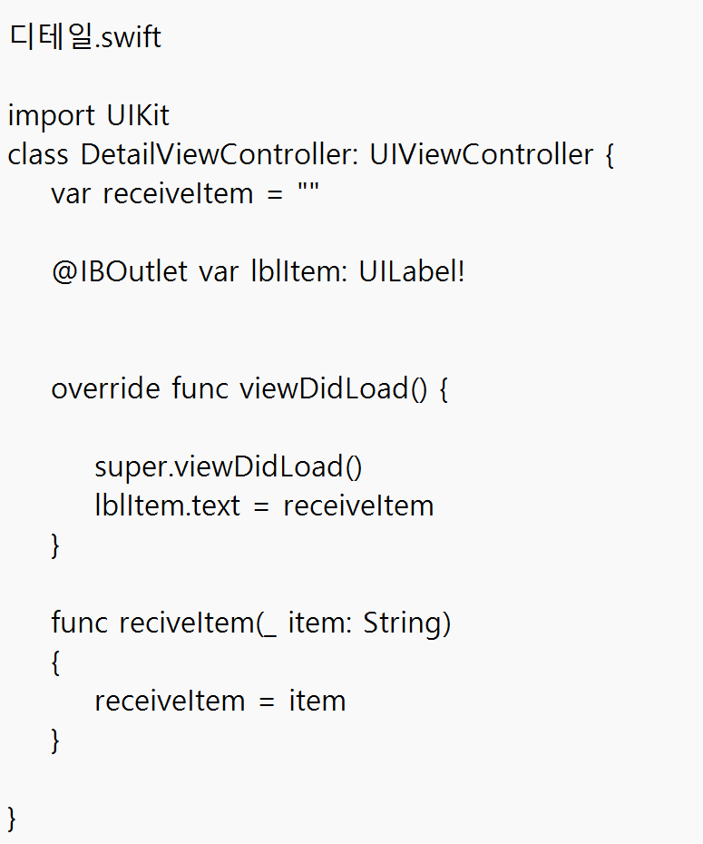
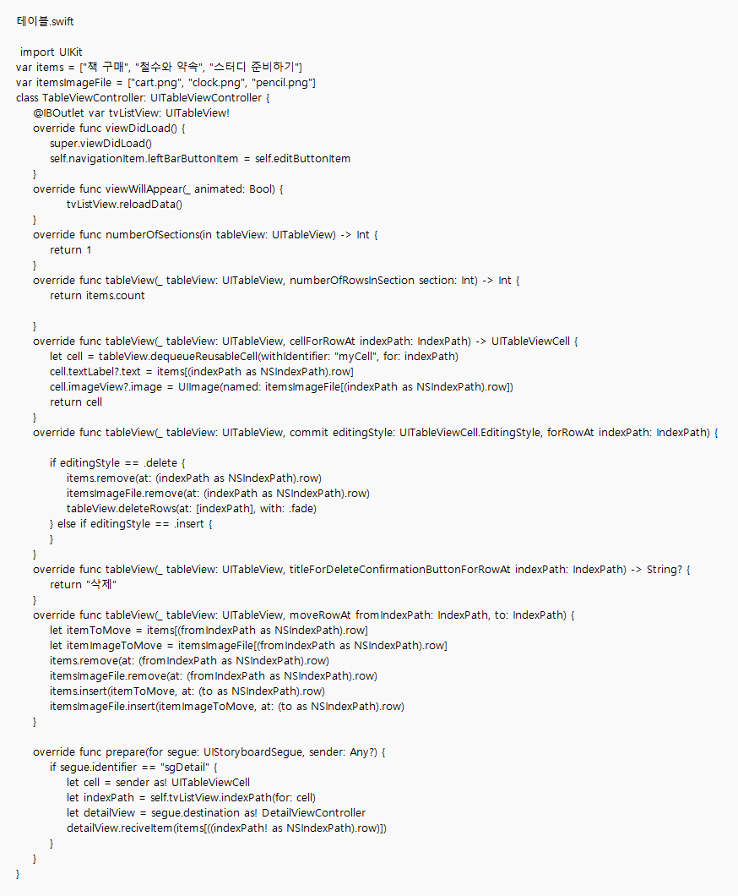
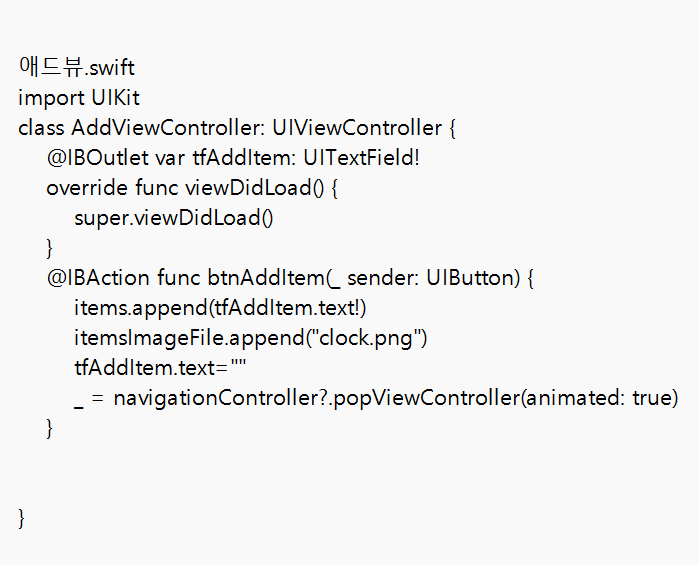
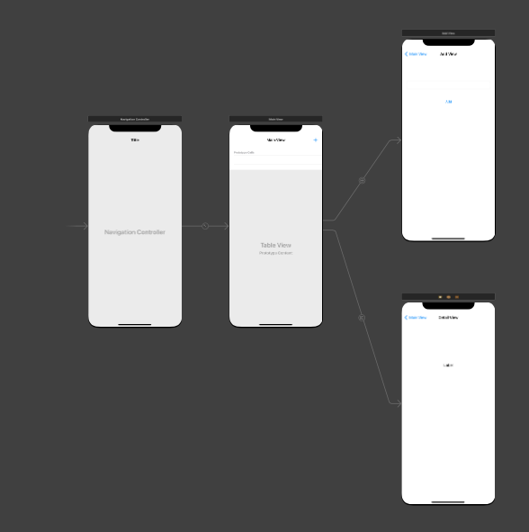
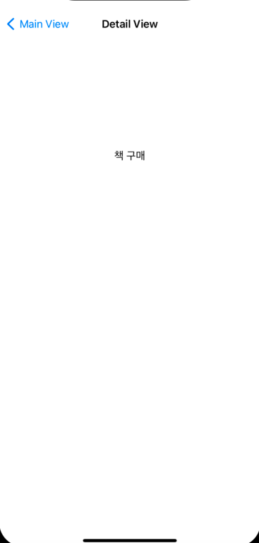

#12장 table

이것은 테이블뷰를 이용해서 할일 만들기 앱 입니다.

앱의 환경은 이렇습니다. 

아래는 앱의 동작사진입니다. 

.png)

이게 앱을 실행하면 처음으로 나오는 화면입니다. 해당 목록을 클릭하면

이렇게 세부내용을 볼수있습니다. main view 버튼을 눌러 초기화면으로 돌아온뒤

-165537349597610.png)

우측 +버튼을 눌러줍니다.

.png)

그러면 이렇게 Add View창에 들어가게 되고 

.png)

중앙에 있는 텍스트 필드에 텍스트를 입력하고 add버튼을 누르면

.png)

이렇게 목록이 늘어납니다. 그다음 좌측의 edit버튼을 누르면

.png)

이런 화면이 되며 우측 라인에 막대기3개 아이콘을 위로 잡고 올리면

.png)

이렇게 순서도 바꿀수 있습니다. 그 다음 좌측 -를 누르면

.png)

이렇게 선택 라인의 삭제 창이 뜨면서 삭제 창을 누르면 삭제가 완료됩니다.

.png)

디테일.swift 에는 해당목록의 세부정보를 불러오는 코드가 있고 add.swift에는 목록을 추가하는 코드가 있으며

table.swift에는 목록 삽입 이미지 코드,edit을 누르면 목록변경,삭제 할 수 있는 코드 , 초기 목록(책 구매, 철수와 약속, 스터디 준비) 변수 코드가 있습니다.

여기까지가 테이블뷰 컨트롤러를 이용한 목록 앱  동작입니다
