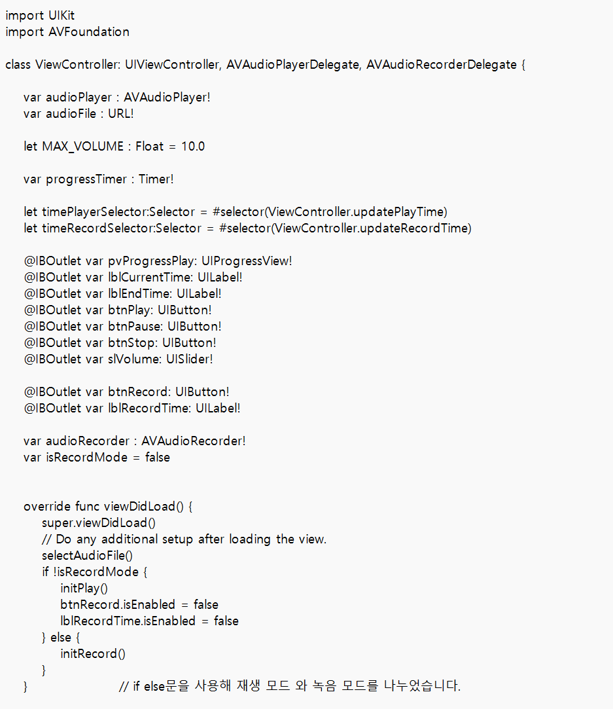
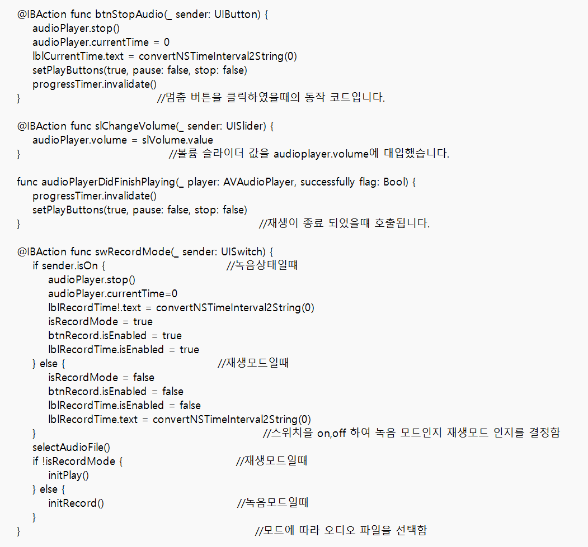

#13장 audio

이 코드는 프로그레스 뷰와 버튼, 슬라이더,레이블,스위치를 이용하여 만든 오디오 플레이어 앱 코드입니다. 
음악을 재생하면 프로그레스 뷰를 통해 재생 정도를 볼수있고 3개의 버튼이 각각 재생,일시정지,멈춤의 기능을 하고 있습니다. 
그리고 슬라이더를 이용해 앱의 볼륨을 변경할 수 있으며 스위치를 키면 녹음 기능이 활성화 되며 버튼을 누르면 녹음이 시작 됩니다 
녹음이 시작되면 녹음 시간이 레이블에 카운트가 시작됩니다. 

아래는 앱의 동작 사진입니다.

.png)

앱을 실행시키면 이러한 화면이 출력됩니다. 여기서 play버튼을 누르면

.png)

버튼이 눌러지면서 오디오가 실행됩니다. 오디오 재생정도도 프로그레스 뷰로 확인 가능합니다.

슬라이더로 볼륨도 조절이 가능합니다. 그 다음 pause 버튼을 누르면

-16547873650165.png)

pause버튼이 눌려지면서 재생이 멈추고 프로그레뷰 재생 정도도 멈춥니다.

stop 버튼을 누르면 stop버튼이 눌려지면서 재생 했던 오디오 파일이 초기화가 됩니다.

그리고 스위치을 off시키면

 .png)

위와 같이 레코드가 비활성화가 된것을 확인 할 수 있습니다. 스위치를 다시 on상태로 하고 record 버튼을 누르면

.png)

위와 같이 record 버튼은 stop으로 바뀌고 녹음이 진행되는 것을 확인 할수 있습니다.

여기까지가 오디오 재생과 녹음 앱 동작입니다.
