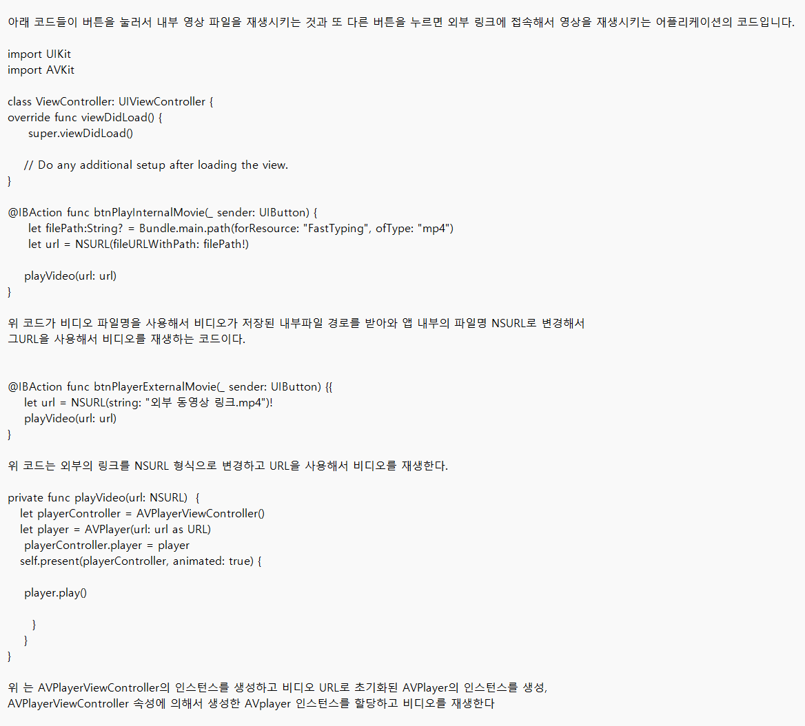
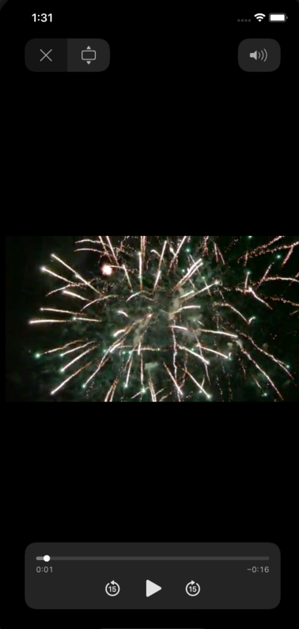

---
layout:	title
single: 14장 video
---

#video

아래는 앱의 동작 과정입니다.

-16550428683392.png)

보시다시피 2개의 버튼이 있습니다. 2개의 버튼중 위의 버튼이 내부영상 재생 버튼이고 아래에 버튼이 외부영상 재생 버튼입니다.

위 버튼을 누르시면

.png)

이렇게 내부에 저장된 영상이 재생됩니다.

반대로 아래의 버튼을 누르시면

외부 링크를 타고 외부 영상을 재생하게 됩니다.
