기말고사로 제출한 테이블 뷰 컨트롤러를 이용해서 만든 스케쥴 앱입니다.

아래는 앱의 개발 환경입니다.

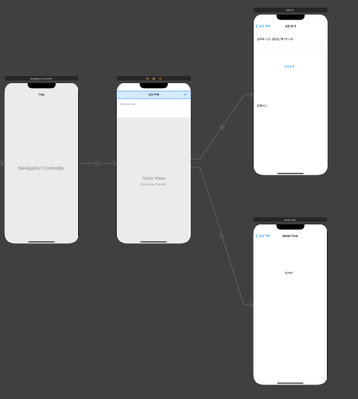

아래는 해당 어플의 소스코드입니다.

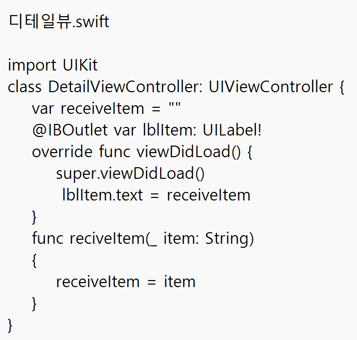

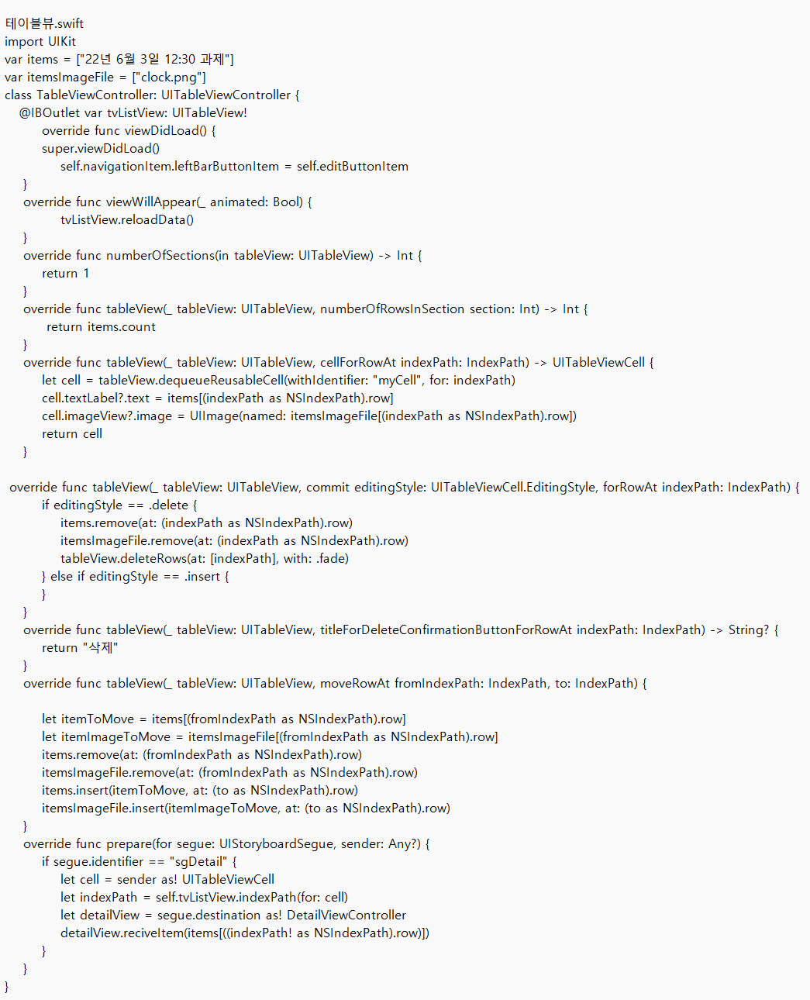

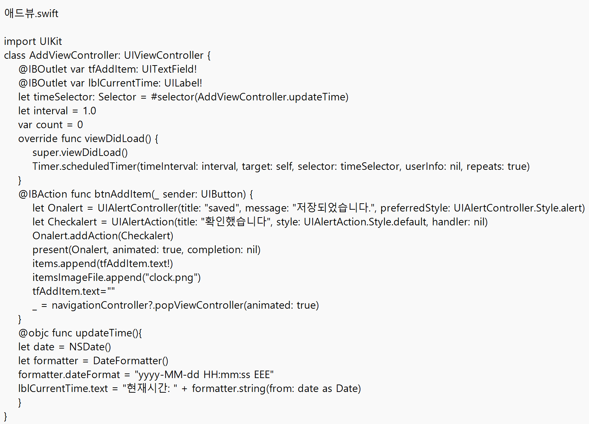

동작과정을 이러합니다.

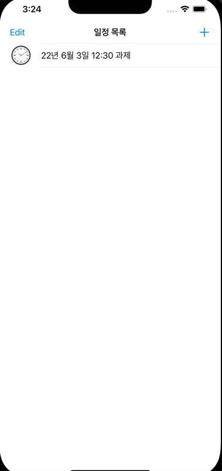

앱을 실행 시키면 이러한 화면이 나옵니다. 해당 목록을 클릭하면

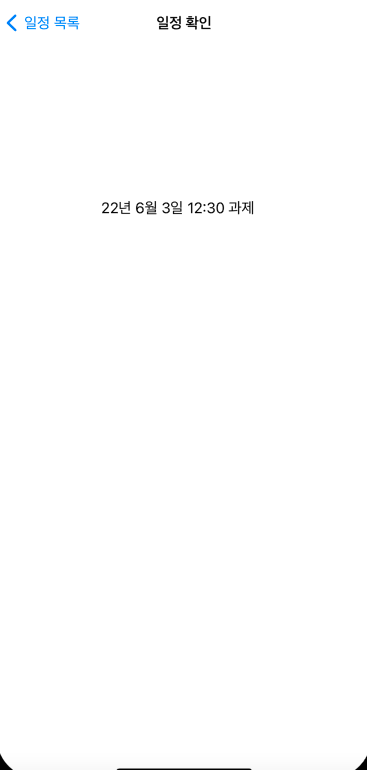

해당 일정을 크게 볼 수 있습니다. 좌측 일정 목록 버튼을 누르면 처음 화면으로 돌아옵니다.

목록을 추가하고 싶으시면 우측에 + 버튼을 누르면 목록 추가창으로 이동됩니다.

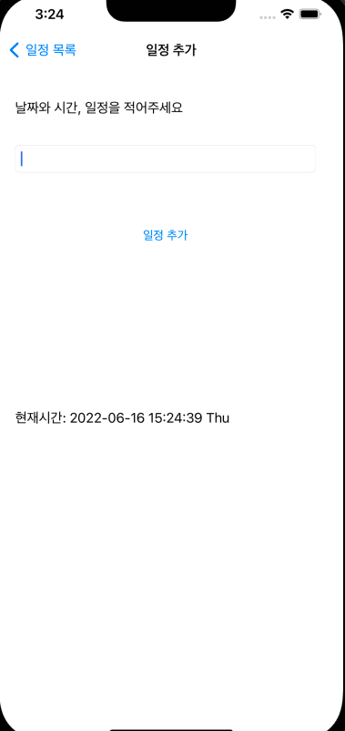

목록 추가창으로 이동한후 해당 텍스트 필드에 현재 시간을 본후 날짜와 시간 해야할일을 적습니다. 

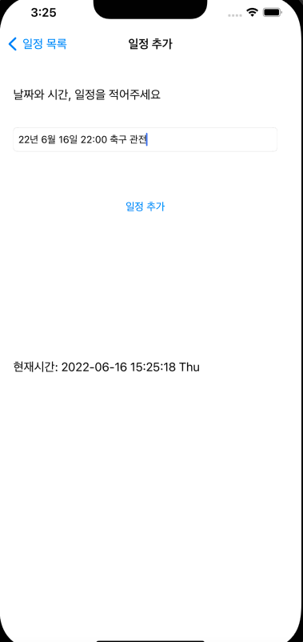

그 다음 일정추가 버튼을 누릅니다. 

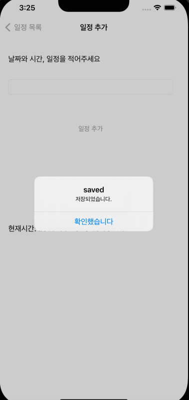

이렇게 얼럿창이 뜨면서 목록이 추가가 됩니다. '확인했습니다'를 클릭하면 창이 닫힙니다. 그다음 좌측에 일정 목록 버튼을 눌러 처음화면으로 돌아가시면

이렇게 목록이 추가된것을 확인할 수 있습니다.  그 다음 목록 순서를 변경하거나 삭제 하고 싶으시면

좌측 edit 버튼을 누릅니다.

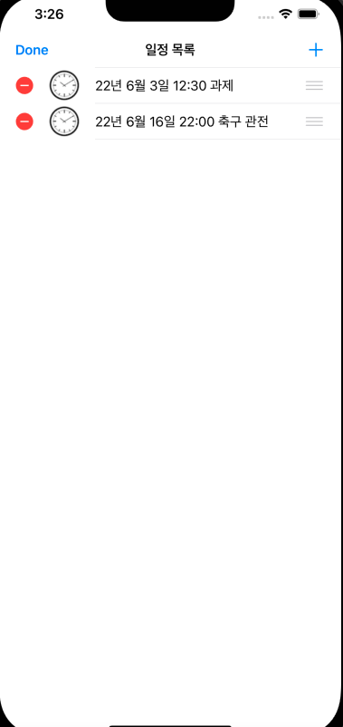

누르면 edit이 done으로 바뀌고 이러한 아이콘이 나타나는데 오른쪽에 막대기 아이콘을 위로 드래그 하면 

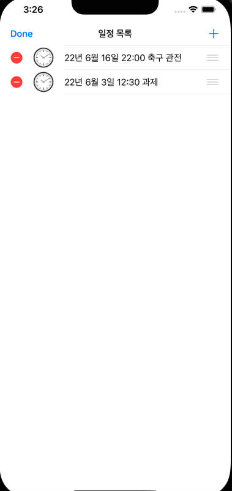

이렇게 목록이 변경됩니다.  목록을 삭제할때는 좌측 빨간 - 아이콘을 누르시면

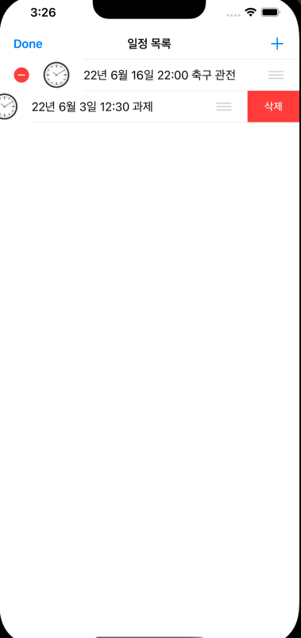

해당 일정에 삭제 창이 뜨면서 삭제를 누르시면 삭제가 진행됩니다.

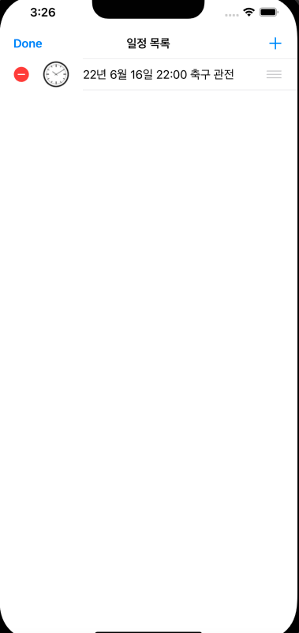

삭제가 된후 좌측에 done 버튼을 누르시면 아이콘이 사라지고 처음화면으로 돌아옵니다.

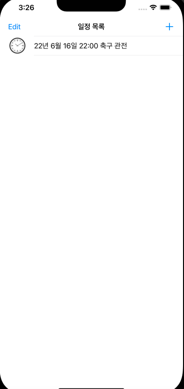

이상으로 일정 목록 리스트 앱이었습니다.
